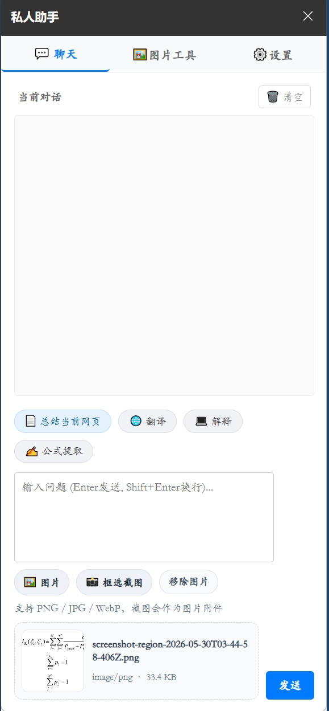
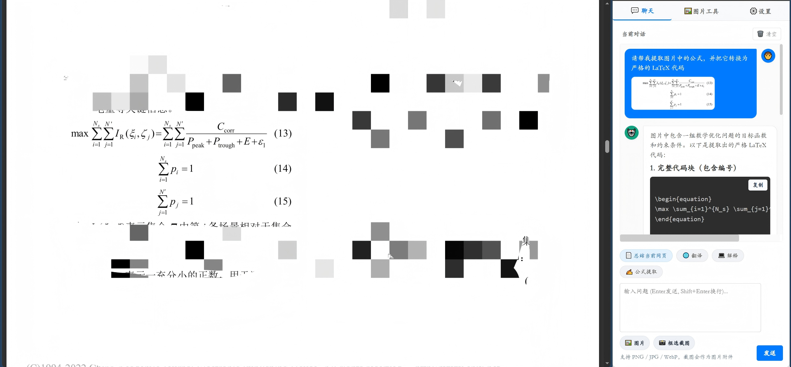

# 私人助手（Chrome 侧边栏 LLM 助手）

Chrome 侧边栏 LLM 助手，支持普通聊天、网页摘要、图片上传/预览、框选截图、公式/数学表达式提示提取以及 Markdown / KaTeX 渲染。设计为轻量、隐私优先的浏览器侧边栏工具，方便在任意标签页内快速发送文本、图片或网页内容给配置的模型 API。

## 快速概览（含截图）
- 聊天界面（支持流式输出与代码块复制）  
  

- 图片上传与预览（支持本地文件、Data URL、HTTP/HTTPS 图片 URL）  
  

- 设置页：填写 API Base URL、API Key 与模型名等配置  
  

- 框选截图 / 网页摘要 等交互示例  
  
  

---

## 功能一览

- 侧边栏聊天，支持流式输出（即时显示模型回复）。
- Markdown 渲染，支持 KaTeX 数学公式渲染；代码块带复制按钮。
- 图片支持：
  - 本地图片上传并自动转换为 PNG Base64 做预览。
  - 支持 `data:image/...;base64,...` 的直接预览。
  - 支持 HTTP/HTTPS 图片 URL（首次使用会请求该站点访问权限以下载图片）。
- 框选截图：用户点击“框选截图”后进入可选区域截图流程，截图作为图片附件发送给模型。
- 网页摘要：用户确认后读取当前网页前 5000 字并自动填入输入框（不会自动发送）。
- 右键菜单：可将选中文本或图片通过右键菜单直接发送到侧边栏。
- 可配置的 API：支持默认 OpenAI API 及兼容的自定义 HTTPS OpenAI-compatible API。

---

## 本地安装（Chrome / Edge 等支持侧边栏的 Chromium 浏览器）

1. 打开 `chrome://extensions`（或浏览器的扩展管理页面）。
2. 开启“开发者模式”。
3. 点击“加载已解压的扩展程序”。
4. 选择本仓库根目录（包含 `manifest.json` 的目录）。
5. 打开侧边栏（浏览器侧边栏面板），进入设置页，填写 API Base URL、API Key 和模型名，点击保存。

---

## 设置说明（侧边栏设置页）
在侧边栏的设置页中需要填写或确认以下项：

- API Base URL（默认）
  - 默认：`https://api.openai.com/v1`
  - 若使用自建或第三方兼容 OpenAI 的服务，请填写该服务的 Base URL（例如 `https://example.com/v1`）。
- API Key
  - 用于调用模型的密钥。注意安全，不要将敏感 Key 共享给不信任的服务。
  - Key 存储在 `chrome.storage.session`（不会写入长期 local 存储），因此浏览器重启后可能需要重新输入。
- 模型名
  - 填写你希望调用的模型名称（例如 `gpt-4o-mini` 或 `gpt-4` 等，视所用 API 支持情况）。
- 保存配置后插件会请求浏览器对目标 API 域名的访问权限，确认后该域名将加入允许列表。

切换为自定义 API 时请重新输入对应的 API Key，避免误把旧 Key 发送到错误服务。

---

## 使用指南（常见操作）

- 发送文本：在侧边栏输入框内输入文本并回车发送；长文本可分段发送或使用“总结当前网页”将页面内容导入输入框后编辑。
- 总结当前网页：点击“总结当前网页”按钮后会请求注入脚本以读取页面内容，读取前 5000 字并填入输入框，用户需手动确认发送。
- 框选截图：
  1. 点击“框选截图”按钮。
  2. 浏览器会请求注入一次性脚本并进入框选模式（若页面受限制或是浏览器内置页面，此操作可能失败）。
  3. 完成框选后图片会以附件形式插入到输入框，用户可编辑并发送。
- 图片上传：
  - 支持拖拽或从文件选择器上传本地图片（会转成 Base64）。
  - 支持粘贴 `data:` URL 或直接输入 HTTP/HTTPS 图片 URL（若为跨域或内网地址，浏览器会弹出额外风险提示）。
- 右键菜单：
  - 选中文本或图片时，右键菜单会显示“发送到私人助手”选项，便于快速把当前页面内容发送给模型。

---

## 权限说明

插件声明并按需申请以下权限：

- `sidePanel`：在 Chrome 侧边栏中显示界面。
- `storage`：保存模型名、API 地址与隐私确认状态。
- `activeTab`：在用户主动打开扩展后，允许读取或截图当前标签页（仅在用户操作时生效）。
- `scripting`：在用户点击“总结当前网页”或“框选截图”时注入一次性脚本。
- `contextMenus`：提供右键菜单功能以发送选中内容。
- `permissions` / `host_permissions`：按需请求对外部 API、图片站点或网页读取的主机权限（默认包含 `https://api.openai.com/*`）。
- 可选主机权限（`optional_host_permissions`）：当用户添加自定义 API、输入额外图片 URL 或请求网页读取/截图权限不足时才会动态请求。

注意：Chrome 的某些内置页（如 chrome://、Chrome Web Store 页面、扩展管理页等）限制注入脚本或截图，这些页面可能无法使用“框选截图”或读取页面功能。

---

## 图片、安全与隐私

- 本地图片和 Data URL 会在本地转换为 PNG Base64，然后随请求发送到配置的模型 API。
- HTTP/HTTPS 图片 URL 在下载前会请求对应站点访问权限；对于 HTTP、本机或内网图片会额外弹出风险确认提示。
- 请阅读详细隐私说明：`PRIVACY.md`。插件会将用户主动输入、确认要发送的网页文本、上传图片和框选截图发送到配置的模型 API；插件不在本地长期保存这些数据（除非浏览器 session 存储的配置项）。

---

## 故障排查 / 常见问题

- 无法注入脚本或截图失败：
  - 检查当前标签页是否为浏览器受限页面（chrome://、Web Store、扩展页面等）。
  - 检查插件是否已在 `chrome://extensions` 中启用，并在需要时授予主机权限。
- 图片无法加载或发送失败：
  - 确认图片 URL 是否可在浏览器直接打开（跨域或内网地址可能需要额外权限）。
  - 本地文件会被转换为 Base64，若遇到大文件可能会内存受限，请优先压缩图片。
- API 错误（401/403 等）：
  - 检查 API Key 是否正确、是否有调用该模型的权限，以及 API Base URL 是否正确。
  - 若切换了 API Base URL，请重新输入对应服务的 API Key。

---

## 未来计划（画饼）
- 可能支持联网搜索以增强上下文检索。
- 可能增加对话历史管理、文件上传、更丰富的插件工具支持与可扩展集成。

---

## 贡献与许可

欢迎提交 issue 或 PR。详情见仓库首页与 `PRIVACY.md`。  
（本项目为轻量浏览器侧边栏插件，README 中展示的内容仅为使用说明和示例，并不包含任何第三方 API Key。）